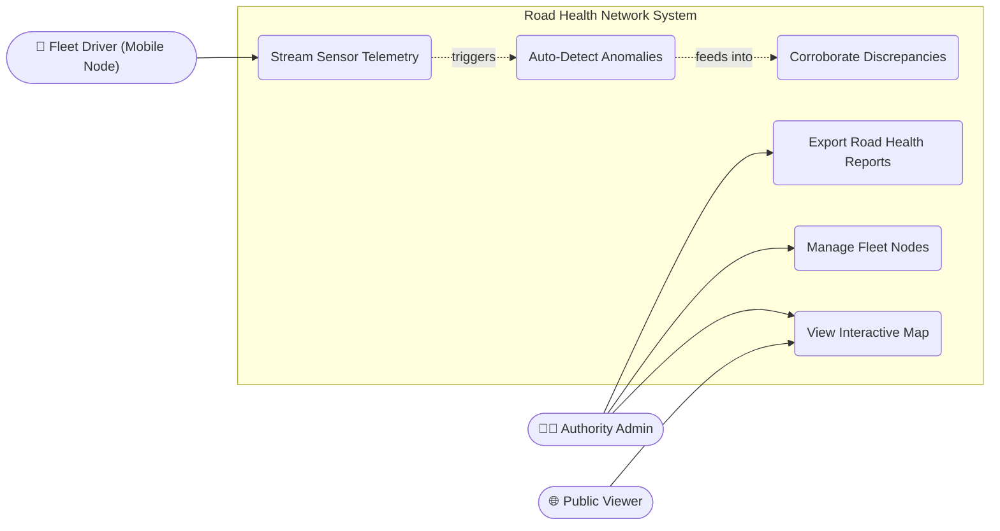
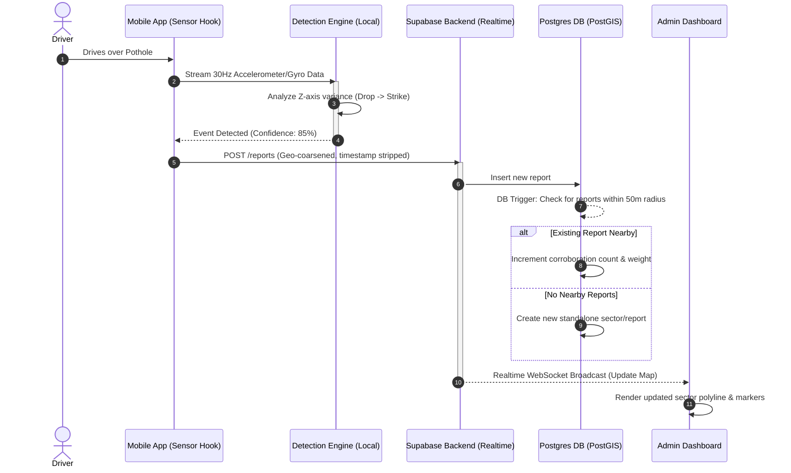
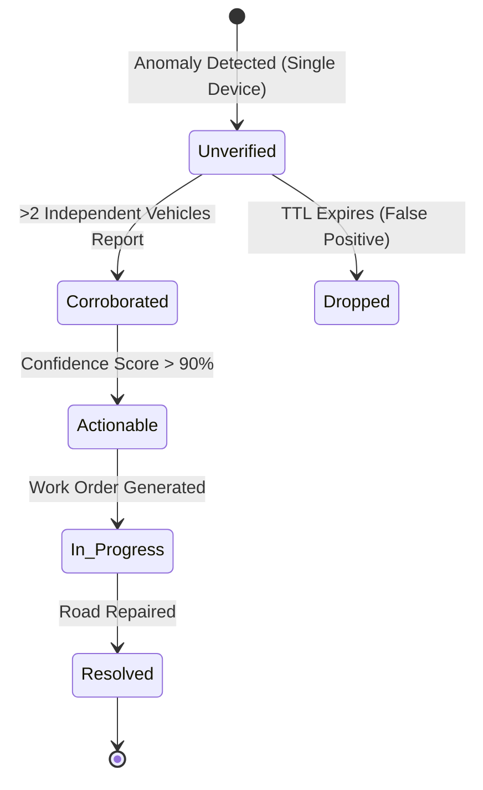
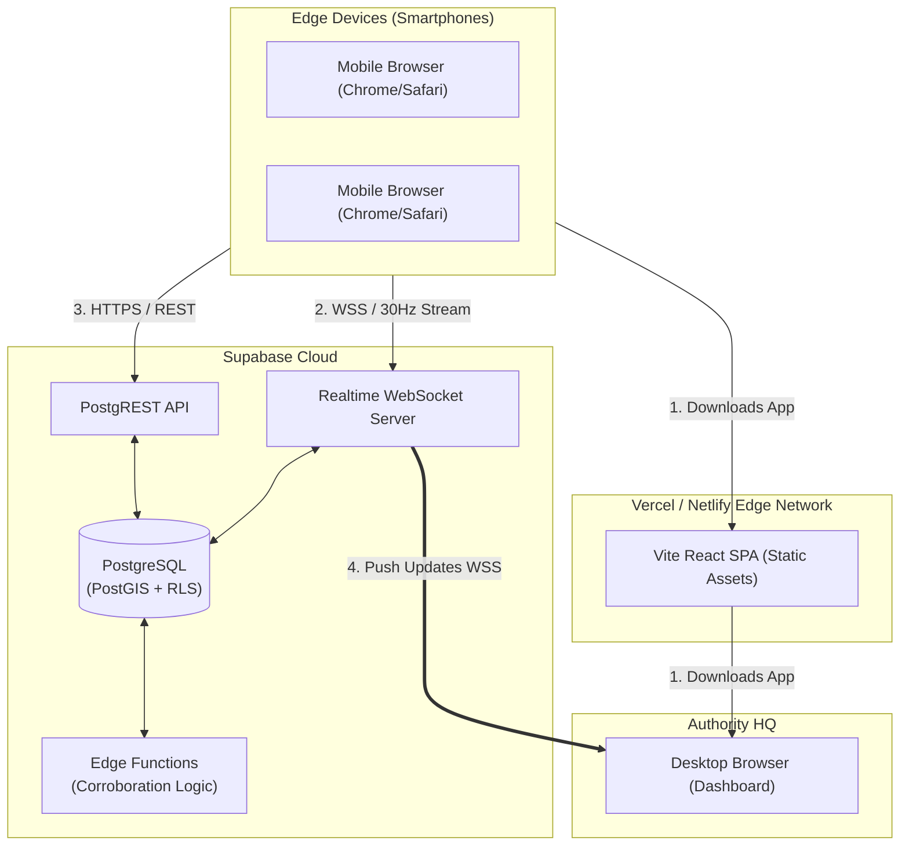
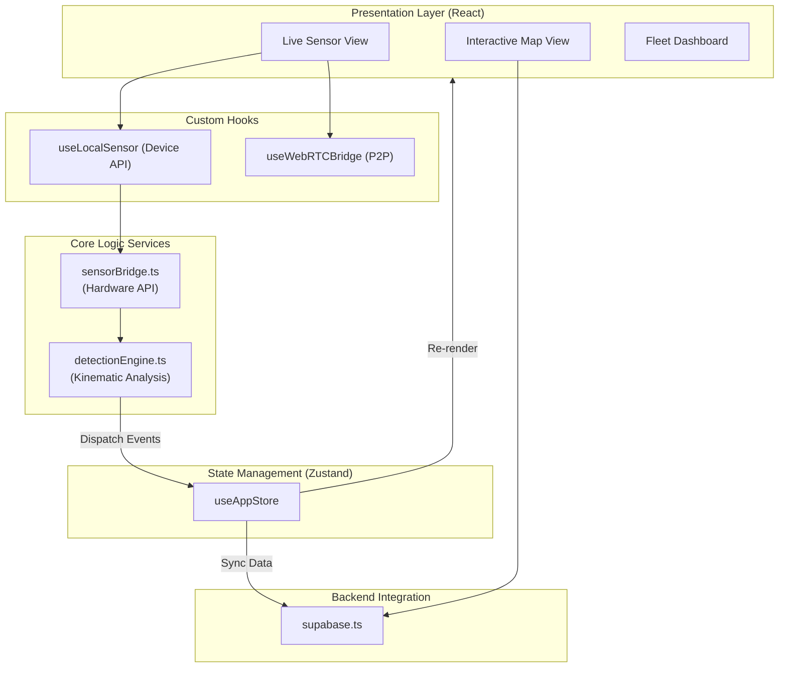

# System Architecture & Design

This document provides a deep dive into the functional and non-functional architecture of the Road Health Network. It details system interactions, data flows, logical components, and physical deployment using UML diagrams.

## 1. Functional Architecture

Functional diagrams describe *what* the system does and how actors interact with it.

### System Use Case Diagram
Provides a high-level view of who interacts with the system and what actions they perform.

### Sequence Diagram: Anomaly Detection to Map Update
Shows the exact temporal flow of data from the moment a smartphone hits a pothole to when it appears on the map for an administrator.

### State Machine Diagram: Report Lifecycle
Details how a detected anomaly matures into an actionable item and eventually gets resolved.

---

## 2. Non-Functional Architecture

Non-functional diagrams describe *how* the system is built, deployed, and how its components are structured physically and logically.

### Deployment Diagram (Physical Architecture)
Shows the serverless infrastructure, demonstrating that the system is scalable, distributed, and how it handles edge deployment.

### Component Diagram (Frontend Logical Architecture)
Breaks down the monolithic React application into logical, decoupled modules.

