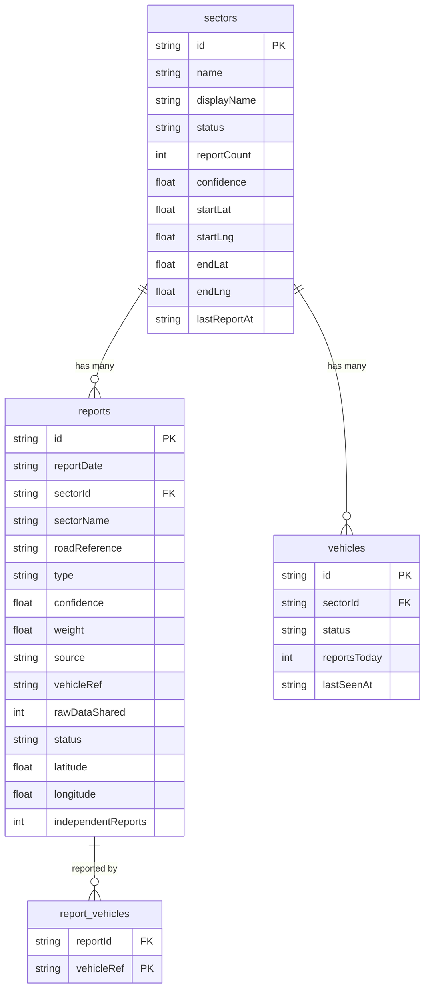

# Road Health Network (RHN)

**Road Health Network (RHN)** is a next-generation platform for government municipalities and highway authorities to monitor road conditions and pavement discrepancies in real-time. 

Built using React, TypeScript, Leaflet, and a lightweight Node/SQLite backend, the application utilizes live smartphone accelerometer data from fleet vehicles to automatically detect, classify, and map road defects without requiring manual data entry.

## 🌟 Key Features

- **Live Sensor Streaming**: Stream 30Hz accelerometer/gyroscope data from a mobile phone directly into the dashboard via WebSocket.
- **Auto-Corroboration Engine**: Discrepancies reported by multiple fleet vehicles in the same geographic radius are automatically merged.
- **Privacy-First By Design**: Avoids exact timestamping and coarsens GPS coordinates (to ~100m) ensuring vehicles cannot be tracked individually.
- **Interactive Network Map**: Fully interactive OpenStreetMap integration displaying color-coded highway sectors and corroborated defect markers.
- **Expanded Discrepancy Types**: Automatic classification of Pot Holes, Severe Cracks, and Waterlogging based on Z-axis/Y-axis shock profiles.
- **Fleet Management**: Monitor connected sensor nodes and historical report volumes in real-time.

## 🚀 Quick Start

### 1. Install Dependencies
Ensure you have Node.js (v18+) installed.
```bash
npm install
```

### 2. Start the Application
The project is completely serverless. Simply run the Vite frontend:
```bash
npm run dev
```
- **Dashboard**: http://localhost:5173

### 3. Connect a Mobile Sensor
1. Open the dashboard (http://localhost:5173).
2. Navigate to the **Live Sensor** tab.
3. Scan the generated QR code using a mobile phone connected to the same local network.
4. Tap **Start Sensor Stream** on your mobile device to begin transmitting live telemetry!

## 🛠 Tech Stack

- **Frontend**: React 18, Vite, TypeScript, Zustand (State Management), React-Leaflet
- **Backend / Database**: Supabase (PostgreSQL, Realtime, RLS) - 100% Serverless
- **Map Tiles**: OpenStreetMap

## 🏛 System Architecture

For a deep dive into the functional and non-functional architecture of the system (including Use Case, Sequence, State Machine, Deployment, and Component diagrams), please see the [ARCHITECTURE.md](./ARCHITECTURE.md) file.

## 🗄️ Database Schema

The application uses Supabase (PostgreSQL) for persistence. The database schema is visualized below:



## 📋 Project Status
This project was developed iteratively through specialized phases (Privacy Model Overhaul, Backend/Datastore, Interactive Mapping, Auto-Corroboration, Live Streaming, and Fleet Analytics) and is ready for broader pilot deployments.

## 📄 License
MIT License
